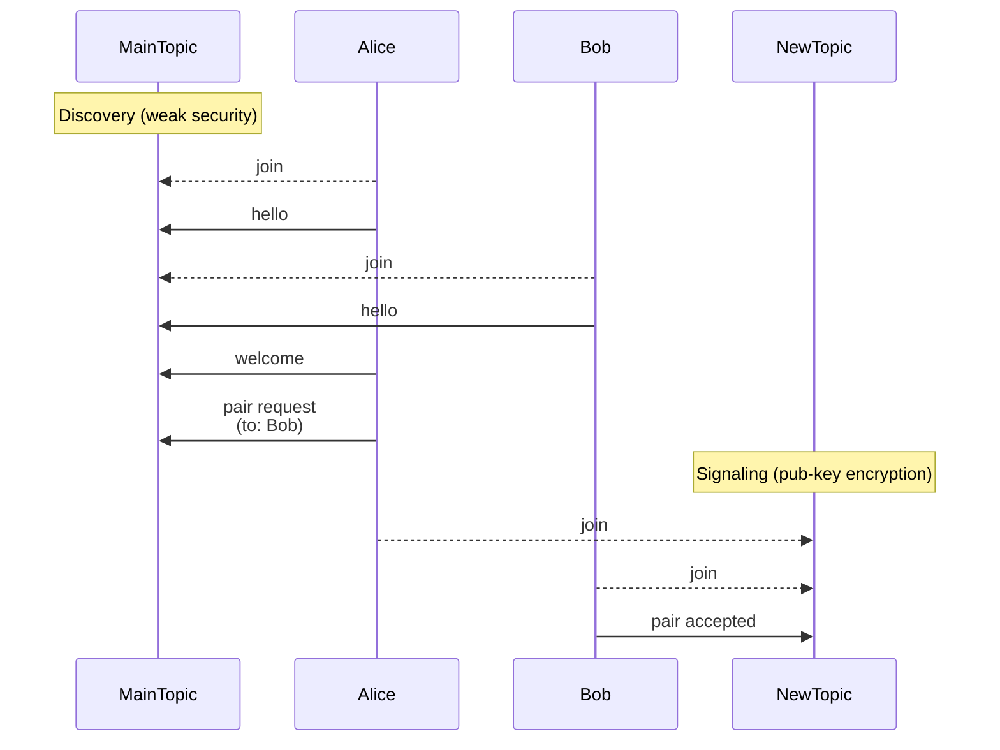

# Glide Signaling Protocol

## Discovery and Pairing
The signaling protocol is used to establish a peer-to-peer connection between two devices using a public channel for initial communication and a private channel for secure key exchange.

When a device first joins the public channel, it sends a "hello" message to announce its presence. This message includes the sender's ID, device type (mobile or desktop), and a color for identification. All other devices should update their device list and respond with a "welcome" message. Devices should not respond to welcome messages or their own hello messages.

When a user wants to connect with another user, they send a "pair request" message in the public channel. This message contains a new topic name and the sender's public key encrypted with a join code. The receiver can then accept the request by joining the new private channel and sending a "pair accepted" message with their public key encrypted with the sender's public key.

_Notes:_
- the "NewTopic" channel should only be known to Alice and Bob. The "MainTopic" channel is a public channel that everyone can join.

### Hello/Welcome Message:
- id: sender ID
- type: sender device type (mobile or desktop)
- color: sender color
- name: string

### Pair Request Message:
- to: receiver ID
- from: sender ID
- key: public key of sender encrypted with join code

## Signaling
We a peer joins a device's private channel, it sends a "start" message with its own public key to initiate the signaling process. At this point, both devices have each other's public keys and can securely exchange messages using public-key encryption. The signaling messages are "offer" and "ice candidate" messages. The joining device should send the first "offer" message, and the receiving device should respond with its own "offer" message. Both devices should also send "ice candidate" messages as they gather ICE candidates.

### Start Message:
- sessionId: unique value for this peering session
- from: sender ID
- key: public key of receiver encrypted with public key of sender

### Offer Message:
- sessionId
- offer: RTCSessionDescription

### Candidate Message:
- sessionId
- candidate: RTCIceCandidate
